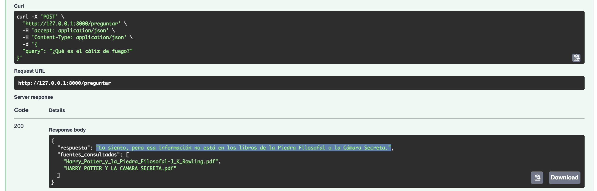

# Hogwarts Oracle Pro: Closed-Domain RAG System 🪄

This project implements a professional **RAG (Retrieval-Augmented Generation)** architecture designed to query specific documentation with 100% accuracy. Using the first two books of the Harry Potter saga as a local knowledge base, the system demonstrates how to restrict an LLM (GPT-4o-mini) to only provide information found within the provided sources.

## 🚀 Key Technical Features

* **Knowledge Boundary Enforcement:** Custom system prompts (Guardrails) prevent the AI from using external knowledge or hallucinating details from later books not present in the database.
* **Vector Embeddings & Persistence:** Uses `OpenAIEmbeddings` to transform text into high-dimensional vectors, stored in a local **Qdrant** collection for fast semantic retrieval.
* **Recursive Chunking:** Implements `RecursiveCharacterTextSplitter` with overlapping (1000 chars, 150 overlap) to maintain semantic context between fragments.
* **Source Transparency:** Every response includes the specific filenames (`source metadata`) used by the AI to generate the answer.

## 🛠️ Tech Stack
* **Language:** Python 3.10+
* **Framework:** FastAPI (Swagger/OpenAPI UI)
* **AI Orchestration:** LangChain
* **Vector Database:** Qdrant (Local Persistent Mode)
* **LLM:** OpenAI GPT-4o-mini

## 📊 Proof of Concept (RAG in Action)

The system is designed to prove its "Closed-World" reliability.

### Case 1: Knowledge Within Scope
When asked about Neville Longbottom (present in books 1 & 2), the system provides a detailed answer and cites the source files.

### Case 2: Out of Scope Prevention
When asked about characters or events from later books (e.g., Luna Lovegood or Sirius Black), the system strictly follows the guardrails and refuses to answer.

## 📁 Project Structure
* `ingesta.py`: Script for loading, splitting, and vectorizing PDF documents into Qdrant.
* `main.py`: FastAPI application serving the RAG logic and the restricted LLM prompt.
* `db_harry_potter/`: Local persistent vector storage.

## 📦 Technical Rationale: Dependency Breakdown

To ensure a robust, scalable, and secure RAG architecture, the following core dependencies were selected:
* **FastAPI & Uvicorn**: Chosen for high-performance asynchronous execution, enabling the system to handle multiple AI queries concurrently without blocking the server.
* **Pydantic**: Guarantees data integrity and strict validation for API requests, acting as a semantic guardrail.
* **LangChain Suite**: Acts as the brain's connective tissue, orchestrating the flow between the user's query, the vector database, and the LLM response.
* **Qdrant Client**: Manages the high-performance vector storage, ensuring that the "retrieval" part of RAG is accurate and sub-second fast.
* **PyPDF**: Provides the underlying engine for parsing and extracting clean text from source PDF documentation.
* **Python-Dotenv**: Ensures security by managing sensitive API keys through environment variables, following industry best practices for configuration.

## 🛠️ Installation & Setup

1. **Clone the repository:**
   `git clone https://github.com/tu-usuario/hogwarts-oracle-rag.git`
2. **Install dependencies:**
   `pip install -r requirements.txt`
3. **Configure Environment:** Create a `.env` file with your `OPENAI_API_KEY` and `QDRANT_COLLECTION_NAME`.
4. **Ingest Data:** Run `python ingesta.py` to vectorize the PDFs.
5. **Start the API:** Run `uvicorn main:app --reload`

---
*Note: This architecture is directly applicable to corporate environments for querying internal manuals, legal documents, or private FAQs while ensuring data security and reliability.*
